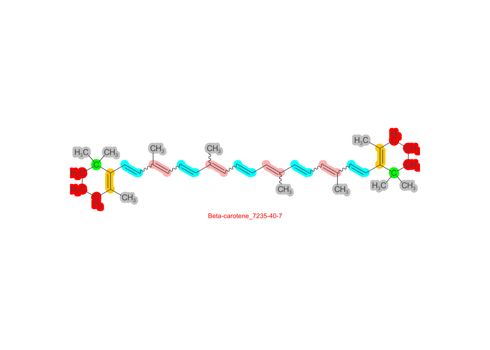
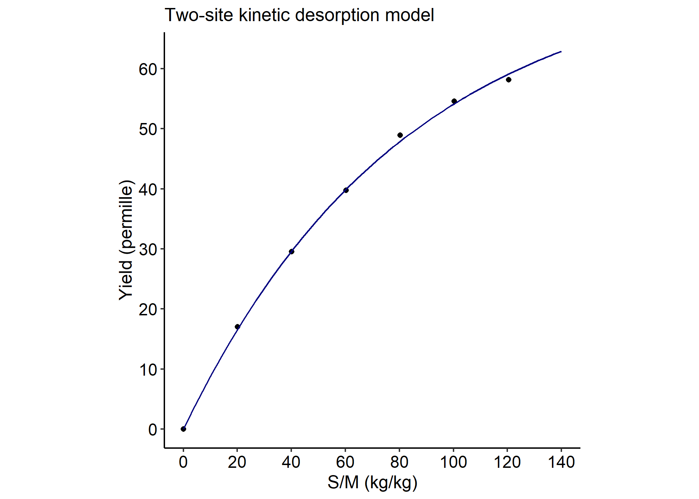
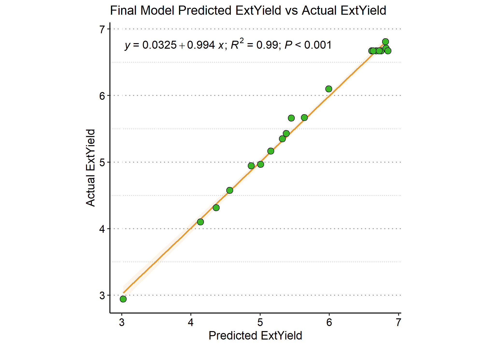

<!-- Useful knitr chunk options -->
<!-- include = FALSE prevents code and results from showing (still runs code) -->
<!-- echo = FALSE prevents code from appearing, but not the results (e.g. figures) -->
<!-- message = FALSE prevents messages that are generated by code from appearing -->
<!-- fig.cap = "" adds caption to graphical results (e.g. ggplot) -->
<!-- eval = FALSE prevents code in chunk from running -->
<!-- ALL OPTIONS: https://www.rstudio.com/wp-content/uploads/2015/03/rmarkdown-reference.pdf -->
<!-- README.md is generated from README.Rmd. Please edit that file -->

# supeRcrit

<!-- badges: start -->
<!-- badges: end -->

## Overview

The package title `supeRcrit` is an abbreviation of “supeRcritical” in
reference to supercritical fluids. The package is designed as a tool for
design, modeling, and optimization of supercritical CO<sub>2</sub> and
(to a lesser extent) subcritical water extraction processes. The package
includes functions for:

1.  Kinetic modeling of such processes using
    [Sovova’s](https://www.doi.org/10.1016/j.supflu.2017.02.014) Broken
    and Intact Cells (BIC) and the two-site [kinetic
    desorption](https://www.doi.org/10.1016/S0021-9673(02)01329-8)
    models (**this is a Work-In-Progress**). See help documentation for
    `?bicmod` and `?ktsmod`. Various supporting functions facilitate
    calculation of CO<sub>2</sub>, ethanol (EtOH), and water densities
    at sub- and supercritical conditions (see `?bendens`, `?etoh_dens`,
    and `?h2o_dens`).

2.  Retrieval of various molecular descriptors and MOL files for target
    compounds from public online databases. See help documentation for
    `?mol_find`.

3.  Predicting the effect of various co-solvents (as supercritical
    CO<sub>2</sub> polarity modifiers) on the solubility of a target
    compound(s) using the [Hansen Solubility Parameters
    (HSP)](https://www.doi.org/10.1016/j.jfoodeng.2025.112538). See help
    documentation for `?sfe_mod`.

4.  Estimating the boiling point, critical temperature, critical
    pressure, and Hansen Solubility Parameters using various methods
    including the
    [Joback](https://www.doi.org/10.1080/00986448708960487), [Stein &
    Brown](https://www.doi.org/10.1021/ci00019a016),
    [Nannoolal](https://www.doi.org/10.1016/j.fluid.2006.11.014),
    [Stefanis &
    Panayiotou](https://www.doi.org/10.1016/j.ijpharm.2012.01.001) and
    other approaches. See help documentation for `?est_gcm`.

5.  Generating [Design of Experiments
    (DoE)](https://www.doi.org/10.18434/M32189) for both screening or
    process optimization. For an example, see help documentation for
    `?doe_ccd`.

6.  Optimizing SFE and SWE processes using [Response Surface Methodology
    (RSM)](https://www.doi.org/10.1007/s11947-016-1855-2) for one or
    multiple response variables. See help documentation for
    `?doe_analyze` and `?doe_desir`.

7.  Calculating the \[Cost of Manufacturing (COM)\] for optimized SFE
    and SWE processes to maximize profit margin and finalize process
    extraction time. See help documentation for `?calcom`.

## Installation

Use the following command to install `supeRcrit` from
[GitHub](https://www.github.com/Deniz-Koseoglu/supeRcrit):

``` r
install.packages(devtools)
devtools::install_github("Deniz-Koseoglu/supeRcrit", build_vignettes = TRUE)
```

The package may then be loaded via:

``` r
library(supeRcrit)
#> Registered S3 methods overwritten by 'ggpp':
#>   method                  from   
#>   heightDetails.titleGrob ggplot2
#>   widthDetails.titleGrob  ggplot2
```

The package documentation can be accessed with:

``` r
?supeRcrit # documentation
```

## Main functions

The main workflow of `supeRcrit` is supported by the following key and
supporting functions (supporting functions tagged as **incorporated**
are those which are mandatory for completion of the main workflow):

1.  `bicmod` and `ktsmod` - kinetic modeling of SFE and SWE extraction
    processes using **Sovova’s BIC model** and the **two-site kinetic
    desorption model**, respectively. Supporting functions:
    - `bendens` calculates supercritical CO<sub>2</sub> density using
      the [Bender Equation of
      State](https://www.doi.org/10.3303/CET1974120)
    - `etoh_dens` calculates ethanol density at specific temperatures
    - `bic_sm`, `bic_ct`, and `bic_cmp` (**incorporated**) build a
      simplified, “characteristic times”, and complete BIC models
    - `kin_plot` (**incorporated**) plots the model results
    - `kin_splot` visually summarizes the results of multiple kinetic
      models
    - `kin_export` summarizes and exports data in **.CSV** format
      <br/><br/>
2.  `sfe_mod` estimates the ***relative solubility improvement*** of a
    target compound in supercritical CO<sub>2</sub> when one or more
    co-solvents are used at a specific volume fraction(s) as polarity
    modifiers. Supporting functions:
    - `mol_find` retrieves molecular descriptors and a MOL file for a
      molecule given a \[SMILES\]\[link1\] string, CAS number, and/or
      compound name (IUPAC or colloquial).
    - `est_gcm` estimates boiling point, critical parameters
      (temperature, volume, pressure), and/or HSPs via **Group
      Contribution Methods (GCMs)**.
    - `plot_gcm` (**incorporated**) visualizes a molecule from its MOL
      file and optionally highlights sub-structures
    - `hsp_optim` (**incorporated**) calculates the **relative
      solubility improvement (%)** of a target compound in supercritical
      CO<sub>2</sub> using a specific volume fraction of various
      co-solvents. The “best” co-solvent resulting in the highest
      solubility improvement may be determined at one or more
      combinations of pressure and temperature within **75-1000 bar**
      and **31-200 degrees Celsius**, respectively.
    - `show_solv` displays reference HSP parameters and other data used
      by the workflow for various solvents. <br/><br/>
3.  `doe_analyze` systematically creates, analyzes, and (where
    appropriate) simplifies Design of Experiments models, including
    linear models using for screening experiments, as well as the more
    complex quadratic models used by **Response Surface Methodology
    (RSM)** for optimization of one or more responses. Supporting
    functions include:
    - `doe_ffd`, `doe_frfd`, `doe_ccd`, `doe_bbd`, and `doe_tm` generate
      **Designs of Experiments (DoE)** of various types including the
      Full Factorial, Fractional Factorial, Central Composite,
      Box-Behnken, and Taguchi designs for 2-5 factors.
    - `doe_export` and `doeopt_export` compile data from DoE generation
      and analysis, respectively, and export them as an informative
      **.TAB** file.
    - `doex` include some example data to work with.
    - Multiple other incorporated functions provide additional
      functionality but are not intended for standalone use. <br/><br/>
4.  `calcom` calculates the **Cost of Manufacturing (COM)** for SFE and
    SWE processes, including the labor, utilities, raw materials, waste
    management, and fixed costs. Payback period for a given investment
    at any point throughout the extraction process is also calculated,
    facilitating the choice of time that would maximize the profit
    margin. Supporting function include:
    - `show_pars` is a helper function explaining the **input and output
      terms** of the workflow
    - `com_export` compiles and exports all workflow output as a
      **.CSV** file.

For **detailed examples** of all workflows outlined herein, please
consult package vignettes.

## Examples

### Co-Solvent Choice

This module uses the Hansen Solubility Parameters (HSPs) estimated by
Group Contribution Methods (see above), and adjusted based on molar
volume variation with temperature and pressure, to estimate an **HSP
Distance** ****R<sub>a</sub>**** between a target compound and a
CO<sub>2</sub>-co-solvent mixture to be used for extraction. The
workflow begins with retrieval of molecular descriptors from
[SMILES](https://www.daylight.com/dayhtml/doc/theory/theory.smiles.html),
[CAS](https://www.cas.org/about/cas-history), and/or
common/[UIPAC](https://iupac.qmul.ac.uk/class/intro.html) name of any
chosen target compound. While this is carried out automatically as part
of `sfe_mod`, it can also be done separately with `mol_find`:

``` r
#Define beta-carotene as an example
mol <- c("CC1=C(C(CCC1)(C)C)C=CC(=CC=CC(=CC=CC=C(C)C=CC=C(C)C=CC2=C(CCCC2(C)C)C)C)C",
"7235-40-7", "Beta-carotene")

#Retrieve and view molecular descriptors
mol_desc <- mol_find(mol)
mol_desc$IDs[!names(mol_desc$IDs) %in% "InChI"]
#>                                                                      SMILES 
#> "CC1=C(C(CCC1)(C)C)C=CC(=CC=CC(=CC=CC=C(C)C=CC=C(C)C=CC2=C(CCCC2(C)C)C)C)C" 
#>                                                                         CAS 
#>                                                                 "7235-40-7" 
#>                                                                        Name 
#>                                                             "Beta-carotene" 
#>                                                                    InChIKey 
#>                                               "OENHQHLEOONYIE-UHFFFAOYSA-N" 
#>                                                                  Atom_Count 
#>                                                                        "96" 
#>                                                                     H_Count 
#>                                                                        "56" 
#>                                                                          MW 
#>                                                             "536.438201792" 
#>                                                                          MF 
#>                                                                    "C40H56" 
#>                                                                 Aromaticity 
#>                                                                     "FALSE"
```

The function `sfe_mod` may then be used to estimate critical
temperature, boiling point, HSP parameters, and calculate distance
****R<sub>a</sub>**** with the associated **Miscibility Enhancement
(%)** provided by various co-solvent versus pure CO<sub>2</sub>. In the
following example, we compare the co-solvent performance of hexane,
methanol, and methyl oleate at a volume fraction of 10% that of
CO<sub>2</sub>:

``` r
#Compare co-solvent performance of 10% hexane, ethanol, and methyl oleate for dissolving beta-carotene
optres <- sfe_mod(solute = mol,
                  modif = c("Hexane", "Ethanol", "MethylOleate"),
                  vfrac = 0.1,
                  tb = "SB_corr",
                  crit = "NL07_robust",
                  hsp = "SP12")
#> 
#> Retrieving compound data...
#> Calculating/retrieving boiling point ...
#> Calculating/retrieving critical temperature and other parameters ...
#> Calculating/retrieving Hansen Solubility Parameters (HSP) ...
#> Rounding SFE temperature and pressure constraints to whole numbers...
#> Calculating SFE miscibility enhancement using a 0.1 volume fraction of the following modifiers: 'Hexane', 'Ethanol', 'MethylOleate'.
#> Calculating temperature influence of HSP values of solute...
#> Processing molar volumes...
#> Calculating the temperature and pressure influence on HSP of solvent(s)...
#> Calculating Ra distances and Miscibility Enhancement (%)...
#> DONE!

#View miscibility enhancement for hexane (for example) at various temperatures and pressures
optres$sfe$Miscib_Enhancement$`CO2 with Hexane`
#>            32        35       38       41       44       47       50       53
#> 80  16.503822 13.978445 13.40892 13.26744 13.18528 13.12520 13.07761 13.03662
#> 100 19.036809 17.984495 16.92615 15.86689 14.88437 14.17595 13.79343 13.58070
#> 120 20.691262 19.798636 18.89130 18.00806 17.16252 16.37340 15.66392 15.06322
#> 140 21.936299 21.208319 20.42631 19.61972 18.82837 18.06660 17.35909 16.70686
#> 160 22.788201 22.295079 21.67444 20.97504 20.25101 19.52209 18.82187 18.15961
#> 180 23.187964 23.005869 22.61480 22.08231 21.46392 20.80563 20.13973 19.48989
#> 200 23.076217 23.270555 23.18353 22.89245 22.44501 21.91069 21.31774 20.70431
#> 220 22.450671 23.045357 23.32458 23.33325 23.13001 22.76917 22.30883 21.78341
#> 240 21.336380 22.320513 22.98715 23.34577 23.44243 23.33056 23.05957 22.67118
#> 260 19.831379 21.148840 22.16303 22.89579 23.32909 23.51888 23.49185 23.30534
#> 280 18.080903 19.612910 20.91756 21.97973 22.76922 23.28547 23.55498 23.61746
#> 300 16.195290 17.839994 19.34964 20.69070 21.76712 22.60557 23.19791 23.55038
#> 320 14.284332 15.960816 17.55260 19.07071 20.41668 21.52464 22.42184 23.07930
#> 340 12.421188 14.075717 15.67844 17.29117 18.77679 20.11974 21.25194 22.20142
#> 360 10.731561 12.254571 13.82222 15.42937 16.98248 18.43305 19.77015 20.95037
#> 380  9.221442 10.609934 12.03999 13.56022 15.13169 16.62405 18.07238 19.42764
#> 400  7.871312  9.105442 10.40128 11.82188 13.29550 14.78589 16.25426 17.69528
#>           56       59       62       65       68       70
#> 80  13.00104 12.96713 12.93639 12.90705 12.87986 12.86133
#> 100 13.44586 13.34924 13.27535 13.21458 13.16235 13.13163
#> 120 14.58887 14.23995 13.98847 13.80594 13.66791 13.59303
#> 140 16.12514 15.61490 15.18166 14.82464 14.53637 14.37614
#> 160 17.54450 16.97923 16.47385 16.02733 15.63452 15.40058
#> 180 18.86459 18.27225 17.73194 17.23078 16.77764 16.50329
#> 200 20.09442 19.50605 18.94061 18.41427 17.92208 17.61623
#> 220 21.22813 20.66259 20.10217 19.56410 19.04943 18.72761
#> 240 22.21075 21.70632 21.18865 20.66249 20.14696 19.81451
#> 260 22.99347 22.60070 22.15326 21.67757 21.18798 20.86357
#> 280 23.51204 23.27672 22.95298 22.56282 22.13399 21.83790
#> 300 23.70109 23.67838 23.52133 23.26792 22.93666 22.69329
#> 320 23.50862 23.74220 23.80384 23.72339 23.54096 23.37046
#> 340 22.91334 23.42688 23.73456 23.88254 23.88470 23.82070
#> 360 21.94332 22.71856 23.29642 23.68904 23.91489 23.98292
#> 380 20.61805 21.64865 22.47898 23.11649 23.59066 23.80647
#> 400 19.03033 20.25633 21.28919 22.19310 22.89304 23.27522

#View best co-solvent at various temperatures and pressures
optres$sfe$Best_Modifier
#>     32     35     38     41     44     47     50     53     56     59    
#> 80  "MeOl" "MeOl" "MeOl" "MeOl" "MeOl" "MeOl" "MeOl" "MeOl" "MeOl" "MeOl"
#> 100 "MeOl" "MeOl" "MeOl" "MeOl" "MeOl" "MeOl" "MeOl" "MeOl" "MeOl" "MeOl"
#> 120 "Hex"  "Hex"  "MeOl" "MeOl" "MeOl" "MeOl" "MeOl" "MeOl" "MeOl" "MeOl"
#> 140 "Hex"  "Hex"  "Hex"  "MeOl" "MeOl" "MeOl" "MeOl" "MeOl" "MeOl" "MeOl"
#> 160 "Hex"  "Hex"  "Hex"  "Hex"  "Hex"  "MeOl" "MeOl" "MeOl" "MeOl" "MeOl"
#> 180 "Hex"  "Hex"  "Hex"  "Hex"  "Hex"  "Hex"  "Hex"  "MeOl" "MeOl" "MeOl"
#> 200 "Hex"  "Hex"  "Hex"  "Hex"  "Hex"  "Hex"  "Hex"  "Hex"  "Hex"  "MeOl"
#> 220 "Hex"  "Hex"  "Hex"  "Hex"  "Hex"  "Hex"  "Hex"  "Hex"  "Hex"  "Hex" 
#> 240 "Hex"  "Hex"  "Hex"  "Hex"  "Hex"  "Hex"  "Hex"  "Hex"  "Hex"  "Hex" 
#> 260 "Hex"  "Hex"  "Hex"  "Hex"  "Hex"  "Hex"  "Hex"  "Hex"  "Hex"  "Hex" 
#> 280 "Hex"  "Hex"  "Hex"  "Hex"  "Hex"  "Hex"  "Hex"  "Hex"  "Hex"  "Hex" 
#> 300 "Hex"  "Hex"  "Hex"  "Hex"  "Hex"  "Hex"  "Hex"  "Hex"  "Hex"  "Hex" 
#> 320 "Hex"  "Hex"  "Hex"  "Hex"  "Hex"  "Hex"  "Hex"  "Hex"  "Hex"  "Hex" 
#> 340 "Hex"  "Hex"  "Hex"  "Hex"  "Hex"  "Hex"  "Hex"  "Hex"  "Hex"  "Hex" 
#> 360 "Hex"  "Hex"  "Hex"  "Hex"  "Hex"  "Hex"  "Hex"  "Hex"  "Hex"  "Hex" 
#> 380 "Hex"  "Hex"  "Hex"  "Hex"  "Hex"  "Hex"  "Hex"  "Hex"  "Hex"  "Hex" 
#> 400 "Hex"  "Hex"  "Hex"  "Hex"  "Hex"  "Hex"  "Hex"  "Hex"  "Hex"  "Hex" 
#>     62     65     68     70    
#> 80  "MeOl" "MeOl" "MeOl" "MeOl"
#> 100 "MeOl" "MeOl" "MeOl" "MeOl"
#> 120 "MeOl" "MeOl" "MeOl" "MeOl"
#> 140 "MeOl" "MeOl" "MeOl" "MeOl"
#> 160 "MeOl" "MeOl" "MeOl" "MeOl"
#> 180 "MeOl" "MeOl" "MeOl" "MeOl"
#> 200 "MeOl" "MeOl" "MeOl" "MeOl"
#> 220 "Hex"  "MeOl" "MeOl" "MeOl"
#> 240 "Hex"  "Hex"  "Hex"  "MeOl"
#> 260 "Hex"  "Hex"  "Hex"  "Hex" 
#> 280 "Hex"  "Hex"  "Hex"  "Hex" 
#> 300 "Hex"  "Hex"  "Hex"  "Hex" 
#> 320 "Hex"  "Hex"  "Hex"  "Hex" 
#> 340 "Hex"  "Hex"  "Hex"  "Hex" 
#> 360 "Hex"  "Hex"  "Hex"  "Hex" 
#> 380 "Hex"  "Hex"  "Hex"  "Hex" 
#> 400 "Hex"  "Hex"  "Hex"  "Hex"

#View co-solvent ranking based on the number of temperature-pressure couplings where it results in the highest miscibility
optres$sfe$Modifier_Ranking
#> 
#>      Hex     MeOl 
#> 68.06723 31.93277

#View estimated critical parameters
optres$parameters$Critical
#>         Tb         Tc         Pc         Vc 
#>  856.30727 1115.55316   11.15151 1279.09999

#View estimated HSPs
optres$parameters$HSP
#>       dD       dP      dHB   dP_low  dHB_low 
#> 12.41942  0.00000  0.00000  2.31210  6.13510

#View detected functional groups and their contribution to the GCM estimation methods
optres$parameters$Contribs
#> $Tb
#>     Group ID Type Tb_cont Occurrences Sum_Tb_cont
#> 1    -CH3  1    1   21.98          10      219.80
#> 3   >CrH2  3    1   26.44           6      158.64
#> 7    >Cr<  7    1   11.12           2       22.24
#> 9  :::CH-  9    1   27.95          14      391.30
#> 11  :::C< 11    1   23.58           4       94.32
#> 12 :::Cr< 12    1   28.19           4      112.76
#> 
#> $Critical
#>               Group ID Type  Tb_cont    Tc_cont     Pc_cont Vc_cont Occurrences
#> 1          CH3-(ne)  1    1 177.3066  0.0418682  0.00081620 28.7855          10
#> 9          -C(r)H2-  9    1 239.4957  0.0212898  0.00034027 24.8517           6
#> 11           >C(r)< 11    1 209.9749 -0.0170459 -0.00051299  5.9550           2
#> 62    >C(r):::C(r)< 62    1 475.9623  0.0564059  0.00034731 34.1240           2
#> 77 >C:::C-C:::C<(c) 89    1 928.9954         NA          NA      NA          12
#>    Sum_Tb_cont Sum_Tc_cont Sum_Pc_cont Sum_Vc_cont
#> 1    1773.0660   0.4186820  0.00816200    287.8550
#> 9    1436.9742   0.1277388  0.00204162    149.1102
#> 11    419.9498  -0.0340918 -0.00102598     11.9100
#> 62    951.9246   0.1128118  0.00069462     68.2480
#> 77  11147.9448          NA          NA          NA
#> 
#> $HSP
#>              Group  ID Type dD_cont dP_cont dHB_cont dP_low_cont dHB_low_cont
#> 1             -CH3   1    1 -123.01 -1.6444  -0.7458     -0.7107       0.2990
#> 2             -CH2   2    1    1.82 -0.3141  -0.3877     -0.1361      -0.1161
#> 4              >C<   4    1  182.13  2.0249  -0.0113          NA           NA
#> 6        -CH:::CH-   6    1   28.65 -0.5037  -0.1253     -0.1503       0.4819
#> 8         -CH:::C<   8    1   62.48 -1.1018  -1.7171      1.2761      -0.0307
#> 42         >C:::C<  70    1   50.10  0.9957  -1.9773          NA      -0.1212
#> 76         C6-ring 831    2  -26.15 -3.6661       NA     -0.9615       0.0000
#> 78        CH3-C::: 833    2   -4.45  0.3461   0.4418     -0.0063      -0.0614
#> 79       -CH2-C::: 834    2  -29.67 -2.3189  -0.5613      0.0192       0.0660
#> 80 >C{H or C}-C::: 835    2   -5.38      NA  -1.0241     -0.4460       0.3422
#>    Occurrences Sum_dD_cont Sum_dP_cont Sum_dHB_cont Sum_dP_low_cont
#> 1           10    -1230.10    -16.4440      -7.4580         -7.1070
#> 2            6       10.92     -1.8846      -2.3262         -0.8166
#> 4            2      364.26      4.0498      -0.0226              NA
#> 6            5      143.25     -2.5185      -0.6265         -0.7515
#> 8            4      249.92     -4.4072      -6.8684          5.1044
#> 42           2      100.20      1.9914      -3.9546              NA
#> 76           2      -52.30     -7.3322           NA         -1.9230
#> 78           6      -26.70      2.0766       2.6508         -0.0378
#> 79           2      -59.34     -4.6378      -1.1226          0.0384
#> 80           2      -10.76          NA      -2.0482         -0.8920
#>    Sum_dHB_low_cont
#> 1            2.9900
#> 2           -0.6966
#> 4                NA
#> 6            2.4095
#> 8           -0.1228
#> 42          -0.2424
#> 76           0.0000
#> 78          -0.3684
#> 79           0.1320
#> 80           0.6844

#Plot detected functional groups for HSP GCM (as an example)
grid::grid.raster(optres$gcm_vis$HSP)
```



The workflow can also predict miscibility enhancement for solvent
**mixtures** with two or more components using the `modif` argument:

``` r
optres_2 <- sfe_mod(solute = mol,
                    modif = list(c("Ethanol", "Water"), "Ethanol", "MethylOleate"),
                    modfracs = list(50),
                    tb = "SB_corr",
                    crit = "NL07_robust",
                    hsp = "SP12")
#> 
#> Retrieving compound data...
#> Calculating/retrieving boiling point ...
#> Calculating/retrieving critical temperature and other parameters ...
#> Calculating/retrieving Hansen Solubility Parameters (HSP) ...
#> Rounding SFE temperature and pressure constraints to whole numbers...
#> Calculating SFE miscibility enhancement using a 0.1 volume fraction of the following modifiers: 'Ethanol:Water (50:50)', 'Ethanol', 'MethylOleate'.
#> Calculating temperature influence of HSP values of solute...
#> Processing molar volumes...
#> Calculating the temperature and pressure influence on HSP of solvent(s)...
#> Calculating Ra distances and Miscibility Enhancement (%)...
#> DONE!

#View the miscibility enhancement of 50:50 Ethanol:Water
optres_2$sfe$Miscib_Enhancement$`CO2 with Ethanol:Water (50:50)`
#>              32         35         38          41         44          47
#> 80    5.9773377   8.807788   8.780473   8.6693804   8.577351   8.4984798
#> 100   0.5248095   3.156391   5.323494   7.0323911   8.201705   8.7325436
#> 120  -4.5162581  -1.458664   1.126737   3.2559895   4.988020   6.3492643
#> 140  -9.7117873  -6.236999  -3.246406  -0.6748124   1.486784   3.2792366
#> 160 -15.0266995 -11.254368  -7.888355  -4.9154899  -2.352421  -0.1523776
#> 180 -20.3685732 -16.405511 -12.784669  -9.4784892  -6.522951  -3.9510668
#> 200 -25.4436670 -21.523162 -17.766251 -14.2406465 -11.002342  -8.0985091
#> 220 -30.0933013 -26.414495 -22.714508 -19.0905816 -15.709819 -12.5141335
#> 240 -34.1465043 -30.890590 -27.395607 -23.8801203 -20.422322 -17.1281351
#> 260 -37.4421206 -34.715443 -31.684846 -28.3835805 -25.068866 -21.6968460
#> 280 -39.8824688 -37.822838 -35.330672 -32.4733136 -29.372077 -26.1601292
#> 300 -41.5201194 -40.129431 -38.240548 -35.8807876 -33.251120 -30.3623866
#> 320 -42.4152918 -41.650265 -40.403660 -38.6466487 -36.470793 -34.0194988
#> 340 -42.6597072 -42.458400 -41.797057 -40.6320235 -39.038820 -37.0432458
#> 360 -42.3714201 -42.651210 -42.507513 -41.9130941 -40.882455 -39.4561100
#> 380 -41.6932910 -42.347730 -42.637796 -42.5499220 -42.041733 -41.1478404
#> 400 -40.7170395 -41.660142 -42.294925 -42.6207094 -42.585382 -42.1758115
#>             50          53         56          59         62          65
#> 80    8.427179   8.3626326   8.303301   8.2464784   8.193069   8.1423776
#> 100   8.861047   8.8603703   8.820892   8.7708824   8.716681   8.6629223
#> 120   7.358545   8.0466017   8.469270   8.6953537   8.802556   8.8418736
#> 140   4.729042   5.8887662   6.786350   7.4618035   7.945732   8.2805137
#> 160   1.696364   3.2282309   4.491586   5.5194276   6.333859   6.9760731
#> 180  -1.725812   0.1694236   1.781666   3.1377866   4.256839   5.1805312
#> 200  -5.531102  -3.2657842  -1.313755   0.3535204   1.787651   2.9920466
#> 220  -9.648985  -7.0667620  -4.803384  -2.8058642  -1.070711   0.4243561
#> 240 -14.032912 -11.1845050  -8.618442  -6.3120925  -4.292228  -2.4959929
#> 260 -18.528767 -15.4869309 -12.678031 -10.1563463  -7.833425  -5.7748140
#> 280 -23.004767 -19.8894599 -16.943440 -14.2035810 -11.665692  -9.3759763
#> 300 -27.322984 -24.2934632 -21.304407 -18.4261900 -15.713172 -13.2309911
#> 320 -31.290308 -28.4335892 -25.548140 -22.6576268 -19.884666 -17.2211298
#> 340 -34.773264 -32.2078879 -29.548763 -26.7669910 -24.048744 -21.3463340
#> 360 -37.646021 -35.5078369 -33.115394 -30.6038242 -27.992961 -25.3569847
#> 380 -39.852312 -38.1792721 -36.223337 -34.0045553 -31.648404 -29.2250474
#> 400 -41.394118 -40.2272690 -38.732206 -36.9150064 -34.926971 -32.6813941
#>              68           70
#> 80    8.0940292   8.06144303
#> 100   8.6104604   8.57637652
#> 120   8.8478566   8.83924928
#> 140   8.5003901   8.60274307
#> 160   7.4711618   7.73109773
#> 180   5.9393425   6.35775609
#> 200   4.0075797   4.59546494
#> 220   1.7125619   2.46614658
#> 240  -0.9371557  -0.01361512
#> 260  -3.9440121  -2.84418292
#> 280  -7.2761860  -6.00837390
#> 300 -10.9169660  -9.49325141
#> 320 -14.7521537 -13.22256893
#> 340 -18.7652543 -17.13108733
#> 360 -22.7562770 -21.09948327
#> 380 -26.6863706 -25.04814457
#> 400 -30.3980257 -28.81053403

#View final co-solvent ranking
optres_2$sfe$Modifier_Ranking
#> 
#>       CO2      MeOl 
#>  2.521008 97.478992
```

### Kinetic modeling (Work-In-Progress)

Modeling of the extraction curve allows the derivation of various
parameters about the **Overall Extraction Curve (OEC)** of a given SFE
or SWE process. For more detail and examples, consult the ****Kinetic
Modeling**** vignette. Various types of BIC (Sovova) and KTS (two-site
desorption) models may be generated via their respective functions,
`bicmod` and `ktsmod`. As input data, a table of time and a response(s)
is used to model the extraction curve.

``` r
## Load and view example data for kinetic modeling
kin_smp <- swex[["duba1"]][["data"]]
kin_smp
#>   Time_min Yield_80C Yield_100C Yield_120C
#> 1        0      0.00       0.00       0.00
#> 2       20     12.71      17.01      18.56
#> 3       40     21.76      29.53      34.92
#> 4       60     29.12      39.77      46.44
#> 5       80     33.51      48.91      54.49
#> 6      100     36.57      54.58      60.98
#> 7      120     39.18      58.15      66.56
```

This data includes SWE results obtained via SWE of defatted grape seeds
at 80-120 degrees Celsius (100 degrees are used here) and 15 bar and 2
mL/min of water flow. The extractable material fraction `c0` is set to
77 permille (parts per thousand), and the mass of sample is 2 grams. The
fraction of easily-desorbed solute, `f`, is set to 0.24 - while this
parameter is usually estimated by the model, it may be provided
separately where an accurate value was previously determined. Non-linear
optimization `nlopt` is used for convergence, and no initial estimates
of output parameters is given in `opt_est`.

``` r
twosite_res <- ktsmod(oec = swex[["duba1"]][["data"]],
oec_vars = c(x = "Time_min", y = "Yield_100C"),
pars = c(pres = 15, temp = 100, flow = 2, c0 = 77, m_in = 2, f = 0.24),
opt_est = "default",
units = c(flow = "mL/min", resp = "permille"),
plot_units = c(x = "q", y = "abs"),
cumulative = TRUE,
mass_flow = FALSE,
flowpar = rep(NA,2),
ro_h2o = NA,
tmax = NA,
qmax = NA,
optmet = "nlopt",
draw = FALSE)
#> 
#> Setting up input variable and initial parameter estimates...
#> Deriving model...
#> Generating plot...
#> DONE!

#Draw model plot
twosite_res$plots$tws
```



It is also possible to view model data and various input, fit, and
overall model parameters:

``` r
#View input data with appended model predictions
twosite_res$data
#>   Time_min Yield_80C Yield_100C Yield_120C        sm yield_g yield_cc0
#> 1        0      0.00       0.00       0.00   0.00000 0.00000 0.0000000
#> 2       20     12.71      17.01      18.56  20.07352 0.03402 0.2209091
#> 3       40     21.76      29.53      34.92  40.14704 0.05906 0.3835065
#> 4       60     29.12      39.77      46.44  60.22056 0.07954 0.5164935
#> 5       80     33.51      48.91      54.49  80.29408 0.09782 0.6351948
#> 6      100     36.57      54.58      60.98 100.36761 0.10916 0.7088312
#> 7      120     39.18      58.15      66.56 120.44113 0.11630 0.7551948

#View model parameters
twosite_res$tws$mod_pars
#>          c0           f          k1          k2 
#> 77.00000000  0.24000000  0.01252658  0.01198262

#Check which of these parameters were modelled
twosite_res$tws$fit_pars
#> [1] "k1" "k2"

#Check input parameters
twosite_res$input
#>         pres         temp         flow           c0      mass_in            m 
#> 1.500000e+01 1.000000e+02 2.867646e-05 7.700000e+01 2.000000e+00 7.000000e+00
```

### Design of Experiments (DoE) generator

This workflow is able to generate Full Factorial, Fractional Factorial,
Central Composite, Box-Behnken, and Taguchi experimental design matrices
with 2-5 factors and 2-5 levels. Additional options include flexible
aliasing patterns, run order randomization, exporting of results,
addition of center points, factor names etc. Some examples of design
generation are presented below:

    #> 
    #> Note that 3-level FFD designs must contain 3 center points by default! Only ADDITIONAL center points are provided in 'cpts'.
    #> Adding center points...
    #> Calculating uncoded factor levels...
    #> $doe
    #> $doe$FFD_3sup3_ResV
    #>    Standard_Order  A  B  C A_Pressure B_Temperature C_Flow
    #> 17             17  0  1  0        300          70.0      3
    #> 5               5  0  0 -1        300          52.5      2
    #> 1               1 -1 -1 -1        100          35.0      2
    #> 25             25 -1  1  1        100          70.0      4
    #> 10             10 -1 -1  0        100          35.0      3
    #> 4               4 -1  0 -1        100          52.5      2
    #> 18             18  1  1  0        500          70.0      3
    #> 30             30  0  0  0        300          52.5      3
    #> 15             15  1  0  0        500          52.5      3
    #> 7               7 -1  1 -1        100          70.0      2
    #> 27             27  1  1  1        500          70.0      4
    #> 29             29  0  0  0        300          52.5      3
    #> 14             14  0  0  0        300          52.5      3
    #> 22             22 -1  0  1        100          52.5      4
    #> 3               3  1 -1 -1        500          35.0      2
    #> 9               9  1  1 -1        500          70.0      2
    #> 23             23  0  0  1        300          52.5      4
    #> 11             11  0 -1  0        300          35.0      3
    #> 20             20  0 -1  1        300          35.0      4
    #> 19             19 -1 -1  1        100          35.0      4
    #> 13             13 -1  0  0        100          52.5      3
    #> 12             12  1 -1  0        500          35.0      3
    #> 2               2  0 -1 -1        300          35.0      2
    #> 24             24  1  0  1        500          52.5      4
    #> 16             16 -1  1  0        100          70.0      3
    #> 8               8  0  1 -1        300          70.0      2
    #> 28             28  0  0  0        300          52.5      3
    #> 26             26  0  1  1        300          70.0      4
    #> 6               6  1  0 -1        500          52.5      2
    #> 21             21  1 -1  1        500          35.0      4
    #> 
    #> $doe$call
    #> doe_ffd(levels = 3, factors = 3, cpts = 3, fnames = c("Pressure", 
    #>     "Temperature", "Flow"), flims = list(c(100, 500), c(35, 70), 
    #>     c(2, 4)))
    #> 
    #> 
    #> $description
    #> [1] "A 3^3 FFD (FULL FACTORIAL) DESIGN OF RESOLUTION V WITH 30 RUNS AND 3 ADDED CENTER POINTS"
    #> 
    #> Note that 3-level FFD designs must contain 3 center points by default! Only ADDITIONAL center points are provided in 'cpts'.
    #> Adding center points...
    #> Calculating uncoded factor levels...
    #> $doe
    #> $doe$FFD_3sup3_ResV
    #>    Standard_Order  A  B  C A_Pressure B_Temperature C_Flow
    #> 11             11  0 -1  0        300          35.0      3
    #> 15             15  1  0  0        500          52.5      3
    #> 22             22 -1  0  1        100          52.5      4
    #> 26             26  0  1  1        300          70.0      4
    #> 8               8  0  1 -1        300          70.0      2
    #> 4               4 -1  0 -1        100          52.5      2
    #> 25             25 -1  1  1        100          70.0      4
    #> 28             28  0  0  0        300          52.5      3
    #> 18             18  1  1  0        500          70.0      3
    #> 13             13 -1  0  0        100          52.5      3
    #> 5               5  0  0 -1        300          52.5      2
    #> 24             24  1  0  1        500          52.5      4
    #> 2               2  0 -1 -1        300          35.0      2
    #> 3               3  1 -1 -1        500          35.0      2
    #> 27             27  1  1  1        500          70.0      4
    #> 7               7 -1  1 -1        100          70.0      2
    #> 1               1 -1 -1 -1        100          35.0      2
    #> 20             20  0 -1  1        300          35.0      4
    #> 10             10 -1 -1  0        100          35.0      3
    #> 23             23  0  0  1        300          52.5      4
    #> 6               6  1  0 -1        500          52.5      2
    #> 12             12  1 -1  0        500          35.0      3
    #> 30             30  0  0  0        300          52.5      3
    #> 19             19 -1 -1  1        100          35.0      4
    #> 17             17  0  1  0        300          70.0      3
    #> 21             21  1 -1  1        500          35.0      4
    #> 16             16 -1  1  0        100          70.0      3
    #> 9               9  1  1 -1        500          70.0      2
    #> 29             29  0  0  0        300          52.5      3
    #> 14             14  0  0  0        300          52.5      3
    #> 
    #> $doe$call
    #> doe_ffd(levels = 3, factors = 3, cpts = 3, fnames = c("Pressure", 
    #>     "Temperature", "Flow"), flims = list(c(100, 500), c(35, 70), 
    #>     c(2, 4)))
    #> 
    #> 
    #> $description
    #> [1] "A 3^3 FFD (FULL FACTORIAL) DESIGN OF RESOLUTION V WITH 30 RUNS AND 3 ADDED CENTER POINTS"
    #> 
    #> Adding star points...
    #> Adding center points...
    #> Calculating uncoded factor levels...
    #> $doe
    #> $doe$CCC_5sup3_with_6_starpoints_and_6_centerpoints
    #>    Standard_Order         A         B         C A_Pressure B_Temperature
    #> 10             10  1.681793  0.000000  0.000000   345.0000      55.00000
    #> 8               8  1.000000  1.000000  1.000000   295.3389      66.89207
    #> 5               5 -1.000000 -1.000000  1.000000   149.6611      43.10793
    #> 1               1 -1.000000 -1.000000 -1.000000   149.6611      43.10793
    #> 17             17  0.000000  0.000000  0.000000   222.5000      55.00000
    #> 7               7 -1.000000  1.000000  1.000000   149.6611      66.89207
    #> 4               4  1.000000  1.000000 -1.000000   295.3389      66.89207
    #> 13             13  0.000000  0.000000 -1.681793   222.5000      55.00000
    #> 20             20  0.000000  0.000000  0.000000   222.5000      55.00000
    #> 9               9 -1.681793  0.000000  0.000000   100.0000      55.00000
    #> 14             14  0.000000  0.000000  1.681793   222.5000      55.00000
    #> 11             11  0.000000 -1.681793  0.000000   222.5000      35.00000
    #> 3               3 -1.000000  1.000000 -1.000000   149.6611      66.89207
    #> 19             19  0.000000  0.000000  0.000000   222.5000      55.00000
    #> 18             18  0.000000  0.000000  0.000000   222.5000      55.00000
    #> 6               6  1.000000 -1.000000  1.000000   295.3389      43.10793
    #> 12             12  0.000000  1.681793  0.000000   222.5000      75.00000
    #> 2               2  1.000000 -1.000000 -1.000000   295.3389      43.10793
    #> 16             16  0.000000  0.000000  0.000000   222.5000      55.00000
    #> 15             15  0.000000  0.000000  0.000000   222.5000      55.00000
    #>    C_Co-Solvent
    #> 10   5.00000000
    #> 8    8.00000000
    #> 5    8.00000000
    #> 1    2.00000000
    #> 17   5.00000000
    #> 7    8.00000000
    #> 4    2.00000000
    #> 13  -0.04537849
    #> 20   5.00000000
    #> 9    5.00000000
    #> 14  10.04537849
    #> 11   5.00000000
    #> 3    2.00000000
    #> 19   5.00000000
    #> 18   5.00000000
    #> 6    8.00000000
    #> 12   5.00000000
    #> 2    2.00000000
    #> 16   5.00000000
    #> 15   5.00000000
    #> 
    #> $doe$call
    #> doe_ccd(design = "CCC", levels = 5, factors = 3, cpts = 6, fnames = c("Pressure", 
    #>     "Temperature", "Co-Solvent"), flims = list(hard = c(100, 
    #>     345), hard = c(35, 75), c(2, 8)))
    #> 
    #> 
    #> $description
    #> [1] "A 5^3 CCC (CENTRAL COMPOSITE) OPTIMIZATION DESIGN WITH 6 STAR POINTS AND 6 CENTER POINTS FOR A TOTAL OF 20 RUNS"

### Response Surface Methodology for DoE Analysis

Once experimental runs associated with any given DoE are completed, a
model of the process may be constructed via Response Surface Methodology
(RSM). This functionality is provided by the `doe_analyze` workflow,
which build and “trims” a linear or quadratic model based on the results
of Lack-of-Fit (LoF) testing, ANOVA, Stepwise Regression, p-value
cutoff, and other metrics. Both the final and initial models are then
summarized and visualized, and optimum process parameters determined by
Canonical Analysis and/or non-linear optimization. An example of a
[Central Composite Design
(CCD)](https://www.itl.nist.gov/div898/handbook/pri/section3/pri3361.htm)
carried out for the SFE of [spearmint
flavonoids](https://www.doi.org/10.1007/s11947-010-0504-4) is shown
below:

``` r
doe_optres <- doe_analyze(doe = doex[["ccd3"]][["data"]],
                          uc_facs = c("P_bar", "T_degC", "EtOH_gmin"),
                          cent_id = NA,
                          resp_var = "ExtYield",
                          time_var = "Actual_Order",
                          mod_order = 2,
                          canon_thres = "auto",
                          p_cutoff = 0.10,
                          trim_method = "both",
                          which_facs = "coded",
                          export = "none",
                          verbose = FALSE)
#> 
#> Preparing data for model building...
#> Building initial model...
#> Carrying out Lack-of-Fit testing of the initial model...
#> Trimming insignificant factors from the initial model using methods: 'both'...
#> Applying the Hierarchy Principle to the initial model...
#> Building final model...
#> Carrying out Lack-of-Fit testing of the final model...
#> Compiling summaries and plots for the initial and final models...

#View final model results (coefficients, t-values, p-values, ANOVA metrics)
doe_optres$results$final$Model_Results
#>         Term   Estimate Aliased Stnd_Error    t_value      p_value Signif_Level
#> 1  Intercept  6.6710364   FALSE 0.03964096 168.286456 1.348672e-18        0.999
#> 2          A  0.3630200   FALSE 0.03646438   9.955469 1.655899e-06        0.999
#> 3          B  0.5244300   FALSE 0.03646438  14.381981 5.234881e-08        0.999
#> 4          C  0.3560500   FALSE 0.03646438   9.764324 1.977068e-06        0.999
#> 5         AA -1.3643909   FALSE 0.06953484 -19.621688 2.586360e-09        0.999
#> 6         AB -0.1957375   FALSE 0.04076841  -4.801205 7.223225e-04        0.999
#> 7         AC -0.1268625   FALSE 0.04076841  -3.111784 1.102713e-02        0.950
#> 8         BB -0.4846409   FALSE 0.06953484  -6.969757 3.853838e-05        0.999
#> 9         BC -0.0966625   FALSE 0.04076841  -2.371014 3.920928e-02        0.950
#> 10        CC -0.2171409   FALSE 0.06953484  -3.122764 1.082294e-02        0.950
#>    Sum_Sq_ANOVA Mean_Sq_ANOVA F_value_ANOVA
#> 1    0.13296509    0.01329651            NA
#> 2    1.31783520    1.31783520     99.111372
#> 3    2.75026825    2.75026825    206.841385
#> 4    1.26771603    1.26771603     95.342023
#> 5   15.93933706   15.93933706   1198.761088
#> 6    0.30650535    0.30650535     23.051567
#> 7    0.12875275    0.12875275      9.683200
#> 8    1.02538826    1.02538826     77.117106
#> 9    0.07474911    0.07474911      5.621710
#> 10   0.12966298    0.12966298      9.751656

#View final model plot of predicted versus actual response
doe_optres$plots$final$FinalModel_ExtYield_vs_Predicted
```



``` r

#View optimized factor values for maximum response (coded)
doe_optres$results$final$Model_Metrics$Canonical_Analysis$xs
#>          A          B          C 
#> 0.06774041 0.45774326 0.69818644

#View optimized factor values for maximum response (decoded)
doe_optres$results$final$Model_Metrics$Canonical_Analysis$xs_decoded
#>          A          B          C 
#> 206.774041  54.577433   8.094559

#View the results of non-linear optimization (alternative to canonical analysis)
doe_optres$results$final$Model_Metrics$Trad_Opt
#> $coded
#>             A          B          C ExtYield
#> 1 -1.00000000 -1.0000000 -1.0000000 2.942101
#> 2  0.06774041  0.4577432  0.6981865 6.927654
#> 
#> $decoded
#>         A        B        C
#> 1 100.000 40.00000 3.000000
#> 2 206.774 54.57743 8.094559
```

## Further Details

The **.PDF vignettes** included with the package are:

1.  *Kinetic Modeling of SFE and SWE* - all aspects of SFE and SWE
    kinetic modeling available in `supeRcrit`.
2.  *Selecting co-solvents for SFE using Hansen Solubility* - estimation
    of co-solvent miscibility improvement with addition of various
    co-solvents and their mixtures.
3.  *Design of Experiments (DOE) generation* - design of experiments
    generation and their analysis via RSM.
4.  *Cost of Manufacturing calculation* - all parameters and examples of
    COM calculations for SFE and SWE processes.

These provide detailed information for all co-solvent selection, process
parameter optimization, cost of manufacturing calculation, and other
workflows. Reading them and applying the examples therein is highly
recommended.
